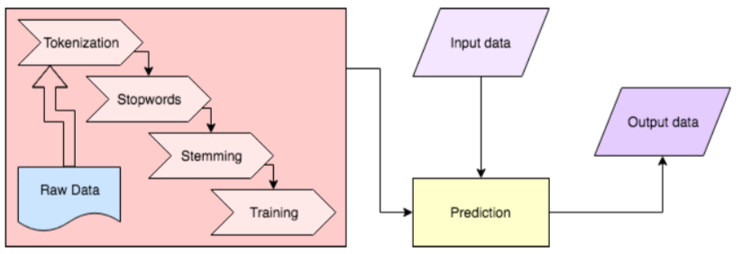
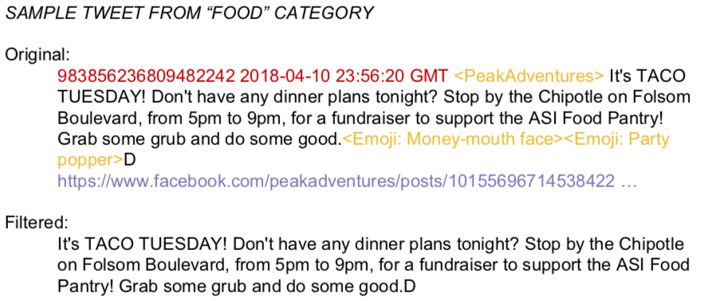
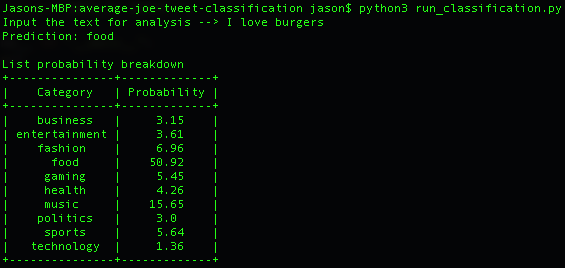

## Description

*Average Joe Tweet Classification* was originally modified based on [Tweet-Classifier](https://github.com/Parassharmaa/Tweet-Classifier) as part of a term project, *Average Joe* [not published], a composite profile (includes a morphed face, sentiment and interests analysis) generator based on Twitter and Instagram public data

*Average Joe Tweet Classification* focuses on the class label of a text, meaning the related topic(s) based on the content. For example, suppose the input tweet is “I love tacos and burgers”, the program should recognizes and outputs a label called “Food”. Ultimately, the system will analyze all tweets and identify the strongest interest per profile.


## Text Classification/ Topic 

Paras' project scrapes relevant tweets based on keywords in **six** fields, such as “Business”, “Politics” and “Technology”. These keyboards are essentially the label for a text category. He also provided three classifier options - Linear SVC, Naive Bayes (MB), and Multinomial Naive Bayes (MNB) from sklearn. With his testing result, Multinomial Naive Bayes produces the highest testing accuracy - 78%.

We expanded topics to the following:
- technology 
- business
- politics
- entertainment
- sports
- health
- gaming
- food
- fashion
- music 


## Dependencies

- numpy
- scipy
- sklearn
- nltk
	- nltk.download('stopwords')
	- nltk.download('punkt')
- punkt

## Usage
#### Workflow



1. Crawling and filtering data
> default 500 tweets per category, filtered. You may also use the [fetch_script](scripts/fetch_script.sh) to crawl all 10 categories and filter them.
>> ```python3 tweep.py```
>> ```python3 filter_tweets.py```
>> 

2. Training Classifier
> The trained model will be store under [data/models](data/models)
>> ```python3 train.py```


3. Classifying Text
> import the classifier along with copying the trained model in another program
>> ```from classify_tweet import Classifier```
	**OR**
> Test run pre-trained model
>> ```python3 run_classification.py```
>> 


## Source
- crawling tweets: [tweep] (https://github.com/haccer/tweep)
<<<<<<< HEAD
- classifier: [Tweet-Classifier] (https://github.com/Parassharmaa/Tweet-Classifier)
- http://scikit-learn.org/stable/tutorial/text_analytics/working_with_text_data.html
